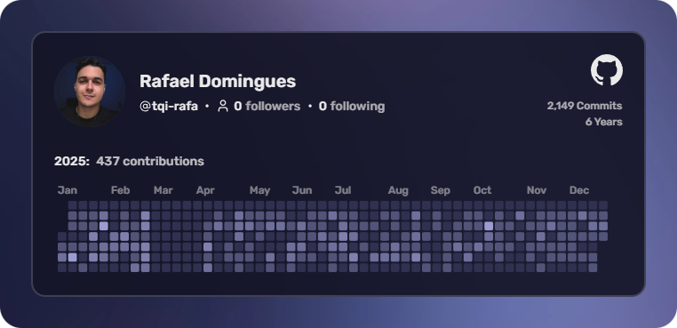

# Rafael Domingues

[➡️ Corporative Profile](https://github.com/tqi-rafa)

---

  
  
  
  

 

- 👨‍💻 Senior Frontend Software Engineer
- ⚡ Skills: **React.js, Typescript, Design Systems, Next.js, JavaScript**
- 🌱 Learning more about and studying: **AI Agents, Spec-Driven Development (SDD), MCPs**
- 💜 Interests: **Games 🎮, Music 🎵, Movies 🎬**
- 👋🏻 Feel free to get in touch!

 

## Activity from [Corporative Profile](https://github.com/tqi-rafa)

